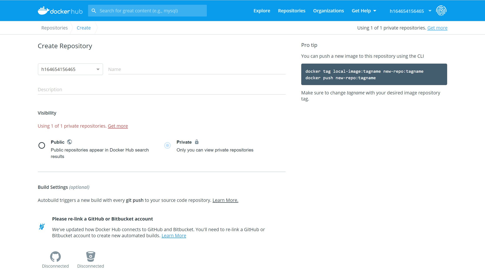
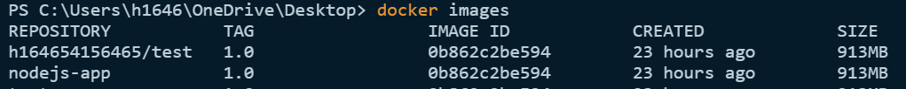
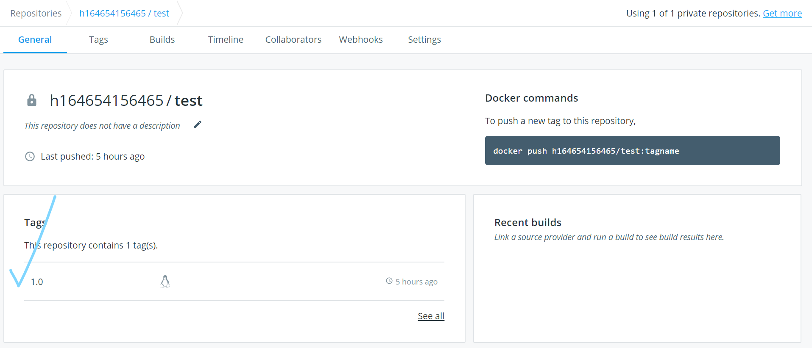

# Docker Desktop for Windows 與 Azure Kubernetes Service 實機操作

## Lab 3 建立 Docker Hub repository，並把 image 推送上去

1.到 Docker Hub 官網並登入，成功後點擊建立 Repository，輸入想要的名稱\<repo-name\>，並把它設定成私人的，記得把自己的\<user-name\>和\<repo-name\>記起來，下一步會用到。



2.推送 image 到 Docker Hub 上面的 repo

```powershell
docker tag nodejs-app:1.0 <your-user-name>/<your-repo-name>:1.0
```

tag 完成後檢查 image 是否存在
```powershell
docker images
```
tag 完成後會多一個 image id 相同，但是 repo 不同的 image



確認好後就把 image 推到 Docker Hub 上方
```powershell
docker push <your-repo>:<your-tag>
```
推送成功後，回到 Docker Hub 下方查看，會看到 repo 下面多出了一個 tag 1.0



* [前往練習 Lab 4](lab-04.md)
* [返回 README](README.md)