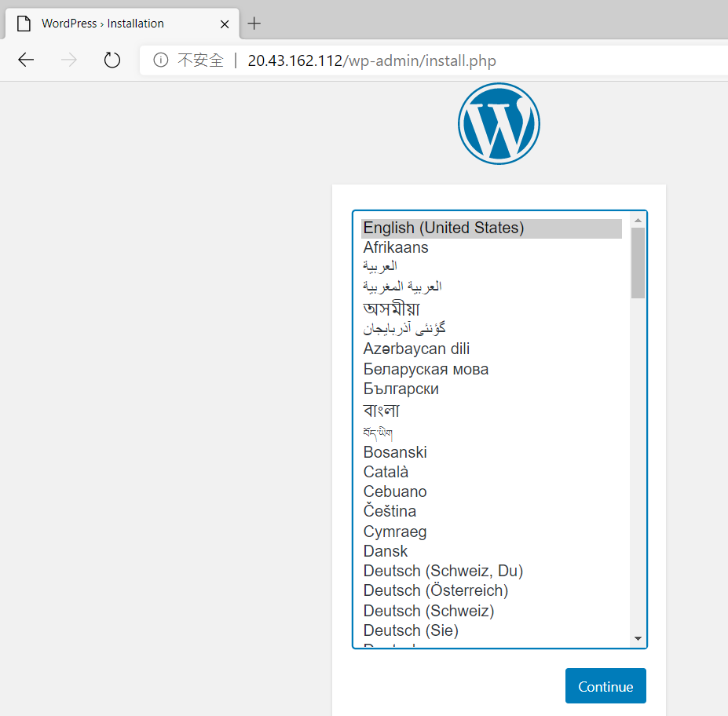

# Docker Desktop for Windows 與 Azure Kubernetes Service 實機操作

## Lab 6 部署使用 Persistent Volume Claim 的 Wordpress 至 Azure Kubernetes Service 叢集

1.以編輯器在 HelloWorld 資料夾內建立一個 wordpress-pvc.yaml 檔案內容如下，定義可以永續保存資料，容量 5 GB 的標準磁碟以供之後 Wordpress 檔案存放使用

```yaml
apiVersion: v1
kind: PersistentVolumeClaim
metadata:
  name: wordpress-volumeclaim
spec:
  accessModes:
  - ReadWriteOnce
  storageClassName: default
  resources:
    requests:
      storage: 5Gi
```
在此 wordpress-pvc.yaml 所在路徑由命令列模式下達以下指令，建立未來存放 Wordpress 名為 wordpress-volumeclaim 的 Persistent 
Volume Claim

```powershell
kubectl apply -f wordpress-pvc.yaml
```
2.接下來以編輯器在該資料夾內建立一個 wordpress.yaml 檔案內容如下，此 YAML 檔案會從 [Docker Hub](https://hub.docker.com/_/wordpress) 取得 Wordpress 5.3 官方映像檔，建立 Kubernetes 的 Deployment, Pod 與 Service 物件，在 Pod 內把 Wordpress 存放 HTML 網頁路徑 /var/www/html 與之前建立的 wordpress-volumeclaim 綁定，而 Wordpress Service 則建立 LoadBalancer 類型以提供 Public IP Address 以便外部連線存取使用。

```yaml
---
apiVersion: apps/v1
kind: Deployment
metadata:
  name: wordpress
  labels:
    app: wordpress
spec:
  replicas: 1
  selector:
    matchLabels:
      app: wordpress
  template:
    metadata:
      labels:
        app: wordpress
    spec:
      containers:
        - image: wordpress:5.3
          name: wordpress
          resources:
            limits:
              memory: 256Mi
              cpu: 250m
            requests:
              cpu: 250m
              memory: 256Mi
          ports:
            - containerPort: 80
              name: wordpress
          volumeMounts:
            - name: wordpress-persistent-storage
              mountPath: /var/www/html
      volumes:
        - name: wordpress-persistent-storage
          persistentVolumeClaim:
            claimName: wordpress-volumeclaim
---
apiVersion: v1
kind: Service
metadata:
  name: wordpress-svc
  labels:
    app: wordpress
spec:  
  selector:
    app: wordpress
  ports:
    - port: 80
      targetPort: 80
      protocol: TCP  
  type: LoadBalancer
```
在此 wordpress.yaml 所在路徑由命令列模式下達以下指令，開始在 Kubernetes 叢集內建立 Wordpress。
```powershell
kubectl apply -f wordpress.yaml
```
鍵入以下指令
```powershell
kubectl get svc
```
則可顯示目前 Service 建立狀況，由於此 wordpress.yaml 定義要建立一個具備負載平衡器的 Service，因此 Microsoft Azure 必須配置一個對外公開的 IP Address 給此負載平衡器，因此需要花費數分鐘的時間，當負載平衡器順利建立完成，應會顯示類似如下結果 :

| NAME           | TYPE         | CLUSTER-IP  | EXTERNAL-IP  | PORT(S)      | AGE |
|----------------|--------------|-------------|--------------|--------------|-----|
| kubernetes     | ClusterIP    | 10.0.0.1    | \<none>      | 443/TCP      | 52m |
| wordpress-svc  | LoadBalancer | 10.0.5.1    | 20.43.162.112|80:30135/TCP  | 3m  |


以瀏覽器連線 wordpress-svc 的外部 IP Address 即可看到 Wordpress 首次執行安裝畫面



* [刪除所建立的 Azure 資源群組](Labs-clear.md)
* [返回 README](README.md)